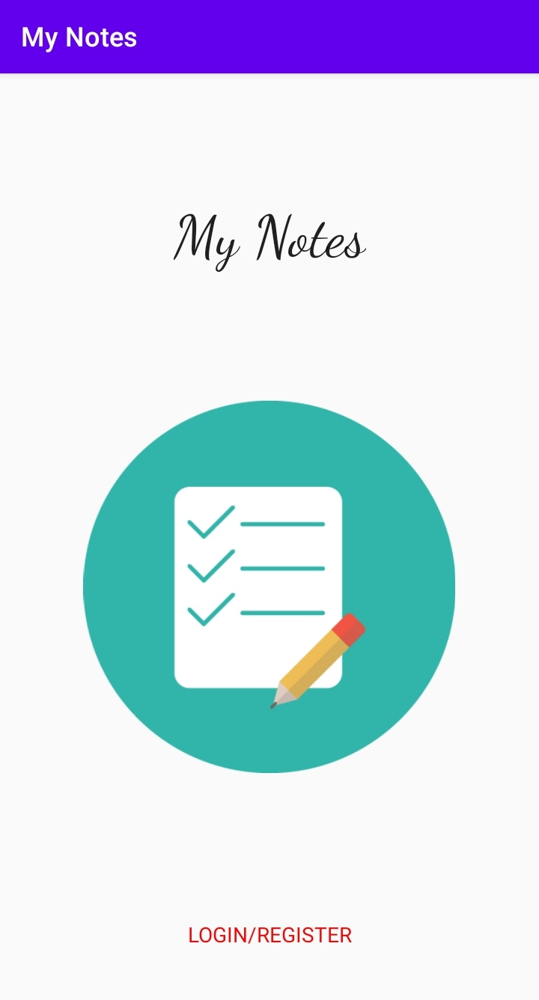
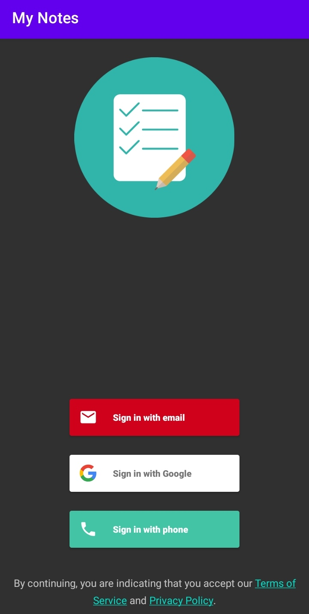
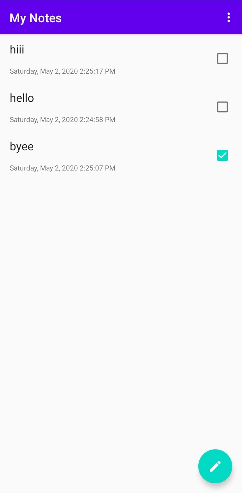
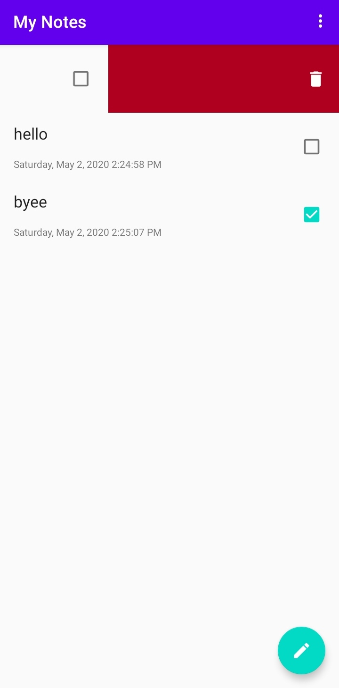

# My Notes

This app is built to practice Firebase implementation and also to learn storing data on cloud
## Features 
 - Online sync and Real time updates 
 - Data is saved on cloud hence no internal memory of the phone is used  
 
## Example Pictures

 
 
 
 
 

## Download

## Developer
Gaurav Raj - [LinkedIn](https://www.linkedin.com/in/gaurav-raj-5893b0195/)
